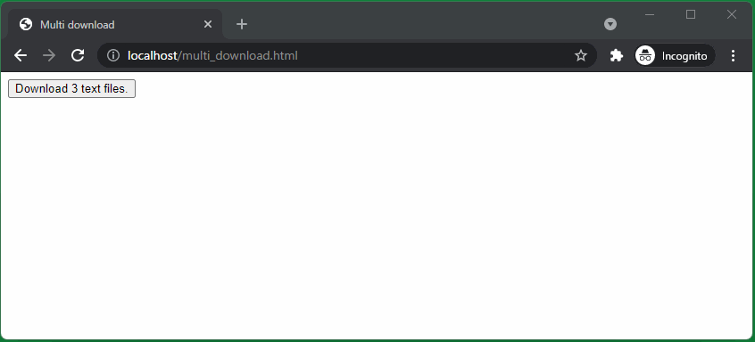

# 複数ファイルダウンロードが並列に動くか確認

## 動作確認手順

### 1. HTTP サーバーイメージのビルド

テキストファイルのダウンロード時間を長くするため、帯域制限を設定した HTTP サーバーイメージを作成する。

詳細は `Dockerfile` を参照。

この `README.md` があるディレクトリで、以下コマンドを実行。

```sh
docker build -t mikoto2000/multi-file-download-test .
```

### 2. HTTP サーバーコンテナ起動

「1.」で実行した Docker イメージを実行する。

この `README.md` があるディレクトリで、以下コマンドを実行。

```sh
docker run -it --rm -p 80:80 -v "$(pwd):/usr/local/apache2/htdocs" mikoto2000/multi-file-download-test
```

### 3. ブラウザでアクセスし、 `Download 3 text files.` ボタンを押下

これで、 3 つのファイルが並列にダウンロードされることが確認できる。



